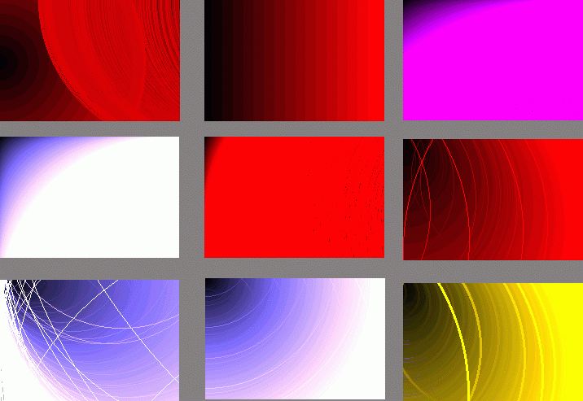



## Color Fades

### Description

The screen shot shows some of the pictures that have been made by this program

This program has 17 premade mathematical shape effects that will make some nice and individual shapes and pictures only with Circle command of a picture box and they are all 3D and ANIMATIONED and cool colorized . it can also save the effects to a picture and also will show you hot wo make base color fades . like blue color fades to black and red to black and green to black
 
### More Info
 

             |
---                |---
**Submitted On**   |2002-11-26 16:36:04
**By**             |[Oooshofdds](https://github.com/Planet-Source-Code/PSCIndex/blob/master/ByAuthor/oooshofdds.md)
**Level**          |Advanced
**User Rating**    |4.0 (8 globes from 2 users)
**Compatibility**  |VB 3\.0, VB 4\.0 \(16\-bit\), VB 4\.0 \(32\-bit\), VB 5\.0, VB 6\.0
**Category**       |[Coding Standards](https://github.com/Planet-Source-Code/PSCIndex/blob/master/ByCategory/coding-standards__1-43.md)
**World**          |[Visual Basic](https://github.com/Planet-Source-Code/PSCIndex/blob/master/ByWorld/visual-basic.md)
**Archive File**   |[Color\_Fade15043711272002\.zip](https://github.com/Planet-Source-Code/oooshofdds-color-fades__1-41091/archive/master.zip)

